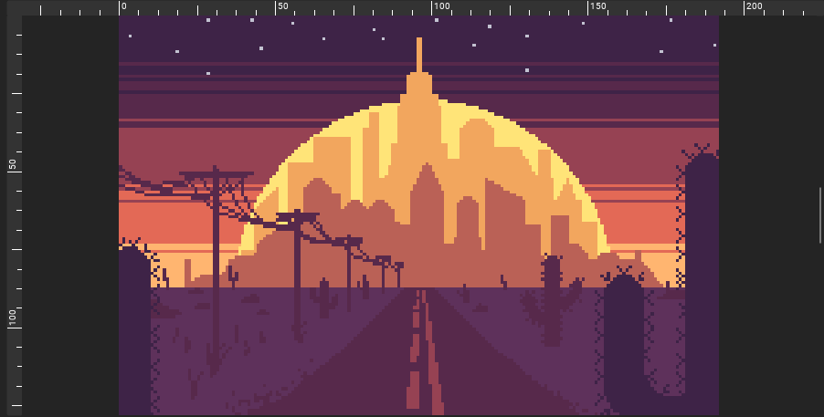
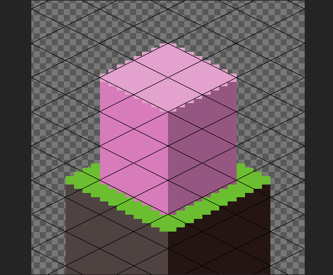

The canvas is the area where your drawing is located and it's also where you apply all of the tools at your disposal. While you can scroll around the canvas without limits, you cannot draw outside the canvas's boundaries, which are set by the size of the image. Of course, you can always resize the project to expand or shrink your canvas's limits.

## Navigation
You can navigate around the canvas in multiple ways.

### Zoom
To zoom, you can use the mouse wheel. Scroll the wheel up to zoom in, and down to zoom out. You can also use <kbd>+</kbd> on your keyboard to zoom in and <kbd>-</kbd> to zoom out. There is also a dedicated zoom tool, which you can use like any other tool, by pressing either the left or the right mouse button, depending on where you mapped it.

### Pan
You can pan by either holding the middle mouse button or <kbd>Space</kbd> on your keyboard and simply moving the mouse. You can also use the arrow keys to move around. Like with zoom, there is also a dedicated pan tool.

### Mirror
You can mirror your view horizontally and undestructively by going to the View menu and clicking "Mirror View", or by pressing <kbd>Shift + M</kbd>.

## Grid
The grid is an important tool that aids the user in accurately drawing lines. Currently, Pixelorama has two types of grids, rectangular and isometric. The rectangular grid is what you will probably use most of the time, while the isometric grid is great if you are making isometric art, like the one pictured below.

### Editing the Grid
The grid's properties can be edited in the Preferences, which is found under the Edit menu, and then selecting "Canvas" on the left side. The option include the grid type itself (rectangular, isometric or both), the width and height of the rectangular grid, the width and height of the isometric bounds of the cells, the x and y offset of the grid, the grid color and whether to draw over Tile Mode.

To toggle its visibility, you can click on "Show Grid" in the View menu, or by pressing <kbd>Control + G</kbd>.

### Pixel Grid
The Pixel Grid is a rectangular 1x1 grid that appears after a certain zoom level. You can change its color and after which zoom level it appears at the same place as the rest of the grid options.

To toggle its visibility, you can click on "Show Pixel Grid" in the View menu, or by pressing <kbd>Control + H</kbd>.

## Second Canvas
On the right side of the canvas, there is a grabber. Moving it to the left will reveal a second canvas. The purpose of this is to easily preview your artwork in different positions or zoom levels. As of right now, you **cannot** draw on it.

## Rulers and Guides
On the top and left sides of the canvas, you can find two rulers. These serve two purposes, the first is to let the user easily and effortesly measure distances in pixels, and the second is to create guides by clicking on them with the left mouse button and, while it's being hold, dragging the cursor to the position you want your guide to be at. Guides are either horizontal or vertical lines that can be used as references to help you to properly align stuff on your canvas.

### Editing Guides
To move an already created guide, you can drag the guide by clicking and holding the left mouse button while your cursor is pointing at the guide but it's also **outside the canvas boundaries**. If it's not, it will simply apply your currently selected tool. If the guide is completely moved outside the canvas area, it will be removed.

You can also change their colors by going to Edit, Preferences, Canvas.

### Toggling Visibility
You can also easily hide the rulers and the guides from the View menu. <kbd>Control + R</kbd> toggles the visibility of the rulers, and <kbd>Control + F</kbd> toggles the visibility of the guides.

## Transparent Background
If you are working with a drawing that has transparent pixels, a checkerboard background will appear there. Its purpose is to simply show that these areas are transparent. The background itself is **not a part of your drawing**. Meaning, it will not be exported along with the final image.

### Editing the transparent background
You can edit the checkerboard background by going to the Edit menu, Preferences, and selecting Canvas. The options include the size of the checkers in pixels, the two colors that make up the checkerboard, and whether they follow the canvas movement and zoom level. If both "Follow Canvas Movement" and "Follow Canvas Zoom Level" are toggled on, the checkerboard match exactly the pixels of the canvas that you draw and will pretty much act as a second grid.
