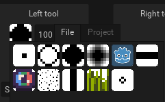

Brushes can be used to easily draw complex shapes and patterns, without having to copy and paste them. The user can also change their color and size.

## Brush Types
Pixelorama comes with three default brushes, the usual pixel/square brush, a hollow circle and a filled circle brush. These brushes are based on algorithms, while all of the other brushes as of right now are based on image data. The main difference is that the image-based brushes are scaled the same way that images are being scaled, which may not always have the result we desire. The image-based brushes are also divided into two types, File brushes and Project brushes. File brushes are being stored as external `.png` files, while project brushes are stored in the [project](project) itself. File brushes can also be Random brushes. Each time you draw using a random brush, the result will be something different!

Image-based brushes will also have one extra option in the tool settings; a "Brush Color From" slider which goes from 0 to 100. If it's set to 0, the resulting color(s) of the brush will come entirely from the image data themselves. Otherwise, if set to 100, the brush color will come from the currently selected color. This setting is important to have because, since image-based brushes rely on image data, this means that they also get to keep the original colors of the image data.

## Making Your Own Custom Brushes

### File Brushes
Pixelorama gives you the option to create your own custom brushes, which you can later use to draw. There are two brush types, File and Project brushes. File brushes are `.png` files saved in the `pixelorama_data/Brushes` directory. They are available for all projects. To create a "File" custom brush, all you need to do is create your brush, and save is as a `.png` file in the `pixelorama_data/Brushes` directory. They will be found on the "File" tab.

### Random Brushes
To make a random brush, save your sprites as multiple `.png` files, with `"~"` at the beginning of their filename, and save them in the same sub-directory. For example, if you want to save a grass random brush, you can create a `pixelorama_data/Brushes/Grass` directory, and name the files something like `~Grass1.png`, `~Grass2.png`, `~Grass3.png`, `~Grass4.png`, and so on. The more files you add, the more variation (random values) your random brush will have.

### Project Brushes
Project brushes are project-dependent, which means that they're not available for all projects. They are saved inside `.pxo` files. To create a Project brush you can [select](../user_manual/selecting) the part of the drawing you want to save as brush, and press <kbd>Control + B</kbd> or go to Edit, New Brush. They will be found on the "Project" tab.

