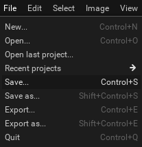

In Pixelorama, the term "Project" refers to the entire sprite, which contains all of the frames it might have. Each project can be saved as a `.pxo` file. Multiple projects can be opened in Pixelorama at the same time, with each one having its own tab.

A Project contains the following properties:
- A set of frames for animations, along with their duration, animation tags and FPS, as well as multiple layers. Frames and layers intersect and create [cels](cel), which are the editable images themselves of the project.
- A [size](../user_manual/transforming/#scale) - width and height - in pixels.
- A name.
- [Brushes](brush) that are local to that specific project.
- [Guides](../user_manual/user_interface/canvas/#rulers-and-guides) - lines that help you draw.

## Saving a project
To save a project, you can go to the File menu and select Save, or press <kbd>Control + S</kbd>. If you are using a Desktop version, you will be able to choose where you want the file to be saved. If you use the Web version, you will be asked for a file name and the .pxo file will be downloaded by your browser.

## .pxo files
Pxo files are Pixelorama's custom file format that saves the entire content of the project. It cannot be opened in other image editors.

### File structure
The file essentially consists of two lines. The first line is all of the project's metadata, such as project name, size, number of layers, number of frames, tags, [project brushes](brush), fps etc. They are stored in JSON form, so they can easily be read by other software.

The second line contains all of the image data as buffers. First, all of the image data for every [cel](cel) is being stored. It starts from the very first cel, which is equivalent to the bottom-most layer and the first frame, then it continues for every layer from bottom to top and once it reaches the final layer, moves on to the next frame, where it again starts from the bottommost layer and continues saving up to the top. After all of the cel image data has been saved, the image data of the project brushes are being saved, if the project has any.

So, in order for a software to read the data of a pxo, it first reads the first line as a JSON object, and then it loops through the buffers, which all have the same size as the project size, until it reads all of the number of frames and layers. After that, if there are more buffers, they correspond to the project brushes, the size of which is stored in the JSON object.

### ZSTD compression
During save, you hare given with the option to select ZSTD compression. If you do, this will reduce your pxo size, but if your project is large and has a lot of content in it, it may take some time to save and load it. Saving projects with ZSTD compression is currently unsupported in the Web version. If you are writing software that supports .pxo file, make sure to detect if the files are compressed first.
