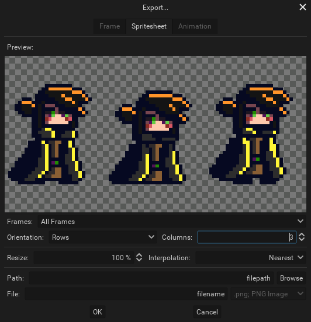
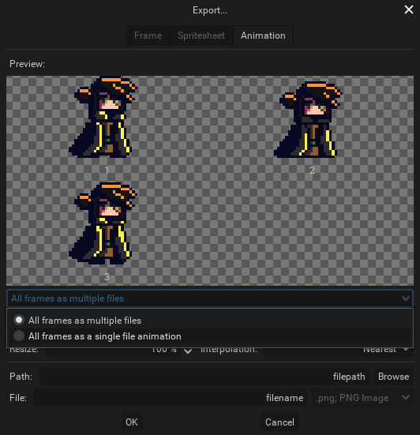

You can either save or export your projects. Saving a project will create a [.pxo file](../concepts/project/#pxo-files), which is Pixelorama's custom file format, while exporting means that one (or multiple, in case of animations) `.png`(s) or a `.gif` file(s) will be created. 

:::tip saving vs exporting
Basically, you should **save** your project if you intent to use it again on Pixelorama and keep all of your data, such as layers, [project brushes](../concepts/brush/#project-brushes), animation tags, etc. While, if you want to share your artwork, import it in another software such as a game engine, or view it on an image editor, you should **export** it. Of course, nothing is stopping you from doing both, which is actually the recommended approach.
:::

## Saving

To save a project, you can go to the File menu and select `Save..`, or press <kbd>Control + S</kbd>, and a window will appear. If you are using a Desktop version, you will be able to choose where you want the file to be saved. If you use the Web version, you will be asked for a file name and the `.pxo` file will be downloaded by your browser.

By selecting `Save...` again on a project you have already saved, the file name and path you chose before will still be automatically used, which means that the old file will be replaced with a new one with the changes you have made. If you'd like to save a different file, you have to use the `Save as...` option, or press <kbd>Shift + Control + S</kbd>.

## Exporting
To export your project, you can go to the File menu and select `Export...`, or press <kbd>Control + E</kbd>, and a window will appear. If you are using a Desktop version, you will be able to choose where you want the file to be saved. If you use the Web version, you will be asked for a file name and the `.png` or `.gif` file(s) will be downloaded by your browser. You are also given the option resize on export, with a chosen interpolation method. This is useful for when you want to share your art and make it easier for people to preview it, because pixel art is most often using small canvas sizes.

Just like with save, you have to use the `Export as...` option or <kbd> Shift + Control + E</kbd> to export to a new directory.

You can choose what you want to export by clicking on one of the tabs on the top of the window.

### Export one frame

By default, the export window is set to export just a single frame. You can choose which frame you want to save by changing the "Frame" number below the preview. This is what you want to use if you are not making an animation.

### Export a spritesheet

You can save the entire animation as a single image containing all of the frames. This is called a `spritesheet`. You can choose how many rows and columns you want your animation to be split into, in the spritesheet. Spritesheets can also be imported into Pixelorama.

### Export an animation

Here, you are given two options. Either save your animation as a sequence of multiple `.png` files, each one for every frame, or save them all as an animated `.gif` file.

If you save your animation as multiple `.png` files, then every file will have a number attached to its name. For example, if the name is `filename.png`, the exported file names will be `filename_1.png`, `filename_2.png`, `filename_3.png` and so on. If these frames also have a frame tag, the name of the tag will be included in the file name as well. You can also choose to automatically create a new directory for each frame tag, for extra organization. This will place all of the frames of the same tag in a different directory.

You save your animation as a single `.gif` file by selecting the "All frames as as single file animation" option under the preview. You are also given the option to select the `.gif`'s animation direction from either forwards, backwards or a ping-pong loop. Keep in mind that if you are working with a large canvas size and/or multiple frames, the `.gif` exporting process can be a bit slow.
